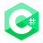

# <span style="color: rgba(150, 400, 200)">*README.md*

## Probando comandos en GIT.

##### Este archivo es para probar comandos desde la consola. Actualmente no tenemoseste archivo readme en el repositorio. Lo agregaremos con el comando **add**.README.md desde la terminal. Este será nuestro primer **commit**.

## Ejercicio Hello World

+  ### JavaScript  
````javascript
console.log("Hola mundo");
````

+ ### Python 
````python
print("Hola Mundo")
````

+ ### C# 
````c#
using System;

class Program{
    static void Main(string[] args){
        Console.WriteLine("Hola Mundo");
    }
}
````

## >>


## Ejercicio Hello World con <span style="color: rgba(350, 120, 700);">`funciones`</span>.

+  ### Javascript 

````javascript
function saludar(nombre) {
    console.log('Hola, ' + nombre);
}
saludar("Mundo");
````

+ ### Python 

````python
def saludar(nombre) {
    print("Hola, " + nombre)
}
saludar("Mundo")
````

+ ### C# 

````c#
using System;
class Program
{
    static void Saludar(string nombre)
    {
        Console.WriteLine("Hola, " + nombre)
    }

    static void Main(string[] args)
    {
        Saludar("Mundo");
    }
}
````
